# Framework for Authoring C++ Committee Papers

## Introduction

This is a paper-writing framework designed to ease the pain of authoring papers
for WG21, built on top of [Pandoc].

In short, you write your papers in Markdown and the framework produces the paper
either in HTML or PDF.

[Pandoc]: https://pandoc.org

## Requirements

  - `python3`
  - `xelatex` (Only for PDF papers)

### OS X

```bash
brew install mactex # Only for PDF papers
```

### Ubuntu

```bash
sudo apt-get install texlive-latex-base # Only for PDF papers
```

### Debian

Debian installation may require these additional packages:

  - `texlive-fonts-recommended`
  - `texlive-latex-recommended`
  - `texlive-latex-extra`

## Integration

```bash
git submodule add https://github.com/mpark/wg21.git

echo "include wg21/Makefile" > Makefile

make <paper>.pdf  # `<paper>.md` -> `generated/<paper>.pdf`
make <paper>.html # `<paper>.md` -> `generated/<paper>.html`
```

See [mpark/wg21-papers] for an example use of this project.

[mpark/wg21-papers]: https://github.com/mpark/wg21-papers

## Generation

```bash
make <paper>.pdf  # `<paper>.md` -> `generated/<paper>.pdf`
make <paper>.html # `<paper>.md` -> `generated/<paper>.html`
```

## Formatting

This framework provides support for various common elements for C++ papers.

- [Title](#title)
- [Table of Contents](#table-of-contents)
- [Markdown](#markdown)
- [Embedded Markdown within Code](#embedded-markdown-within-code)
- [Comparison Tables](#comparison-tables)
- [Proposed Wording](#proposed-wording)
  - [Paragraph Numbers](#paragraph-numbers)
  - [Code Changes](#code-changes)
  - [Wording Changes](#wording-changes)
  - [Grammar Changes](#grammar-changes)
- [Stable Names](#stable-names)
- [Citations](#citations)
- [References](#references)
  - [Automatic References](#automatic-references)
  - [Manual References](#manual-references)
- [Unicode Considerations](#unicode-considerations)

### Title

The title is specified in a YAML metadata block.

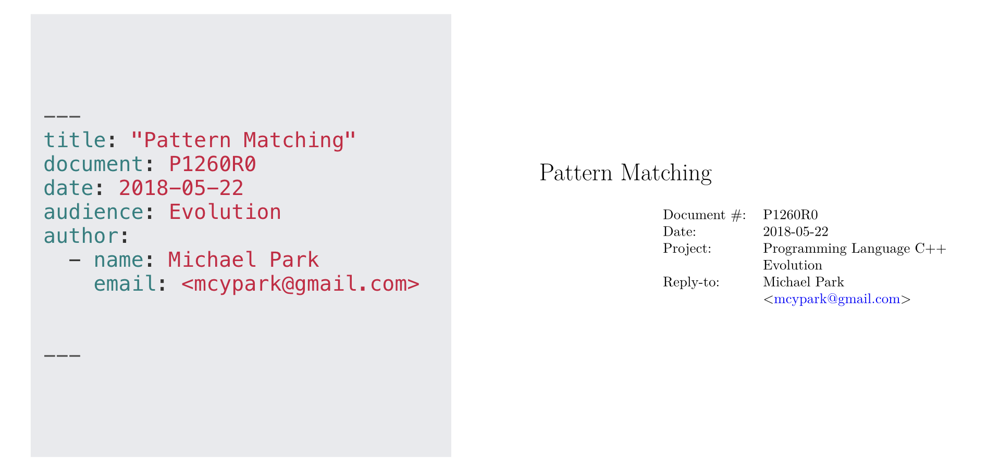

> `date: today` will generate today's date in `YYYY-MM-DD` (ISO 8601) format.

YAML lists can be used to specify multiple audiences and authors:

```yaml
---
title: Integration of chrono with text formatting
document: P1361R0
date: 2018-10-16
audience:
  - Library Evolution Working Group
  - Library Working Group
author:
  - name: Victor Zverovich
    email: <victor.zverovich@gmail.com>
  - name: Daniela Engert
    email: <dani@ngrt.de>
  - name: Howard E. Hinnant
    email: <howard.hinnant@gmail.com>
---
```

### Table of Contents

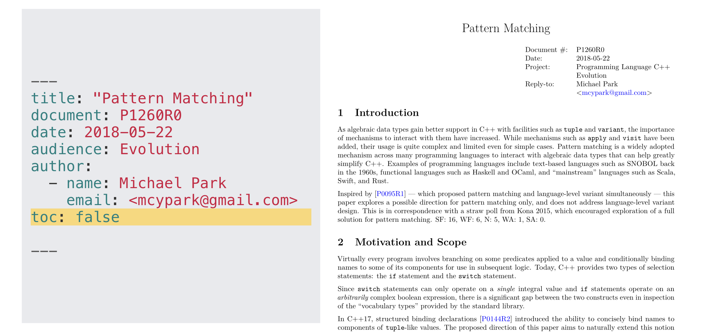

---


---

The default `toc-depth` is `3`, but it can be specified to go deeper:
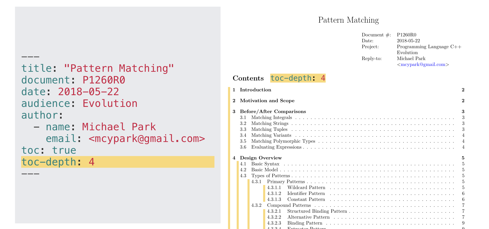

### Markdown

Refer to the full [Pandoc Markdown] spec for useful extensions!

[Pandoc Markdown]: https://pandoc.org/MANUAL.html#pandocs-markdown

### Embedded Markdown within Code

Within default, `cpp`, and `diff` code elements, any text surrounded by the `@`
symbol is formatted as Markdown! This is useful for conventions such as
_`see below`_, _`unspecified`_, and _exposition-only_ variable names.

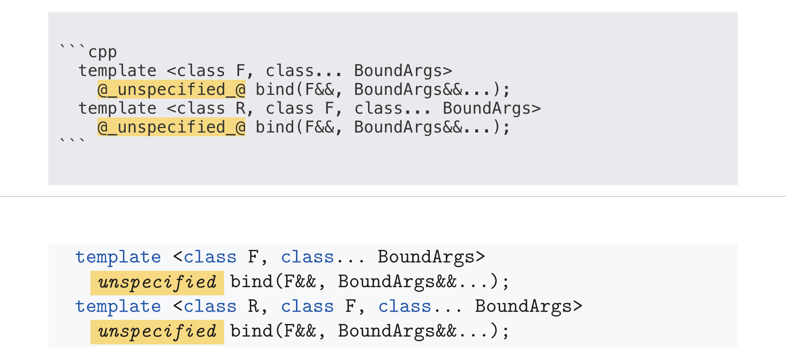

This also works for inline code, e.g.,
```markdown
Recall the `static_cast`{.cpp} syntax: `static_cast < @_type-id_@ > ( @_expression_@ )`{.cpp}.
```


If you need to nest embedded Markdown, surround the outer context with `@@`.
This comes up sometimes if you want to produce inline diffs within a code block,
and some of the inner code need to be marked up.

``````markdown
```
template <@[`invocable`]{.rm}[`class`]{.add}@ F@[`, class`]{.add}@>
struct @_as-receiver_@ {
@[`private:`]{.rm}@
  @[`using invocable_type = std::remove_cvref_t<F>;`]{.rm}@
  @[`invocable_type`]{.rm}[`F`]{.add}@ f_;
@[`public:`]{.rm}@
  @@[`explicit @_as-receiver_@(invocable_type&& f)`]{.rm}@@
  @@[`@_as-receiver_@(@_as-receiver_@&& other) = default;`]{.rm}@@
  void set_value() @[`noexcept(is_nothrow_invocable_v<F&>)`]{.add}@ {
    invoke(f_);
  }
  @[`[[noreturn]]`]{.add}@ void set_error(std::exception_ptr) @[`noexcept`]{.add}@ {
    terminate();
  }
  void set_done() noexcept {}
};
```
``````

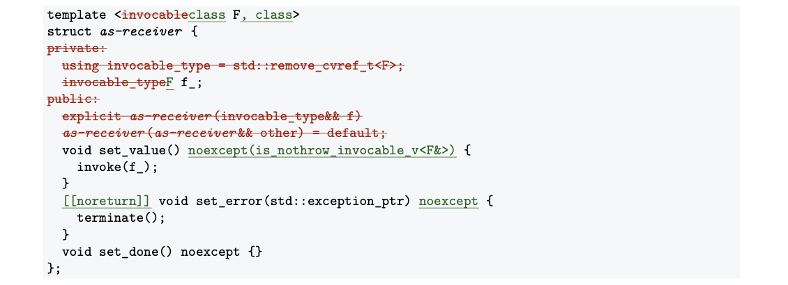

### Comparison Tables

Comparison Tables are [fenced `Div` blocks][divspan] that open with `::: cmptable`
and close with `:::`. [Fenced code blocks][code] are the only elements that
actually get added to Comparison Tables, except that the last header (if any)
before a [fenced code block][code] is attached to the cell above.

``````md
::: cmptable

### Before
```cpp
switch (x) {
  case 0: std::cout << "got zero"; break;
  case 1: std::cout << "got one"; break;
  default: std::cout << "don't care";
}
```

### After
```cpp
inspect (x) {
  0: std::cout << "got zero";
  1: std::cout << "got one";
  _: std::cout << "don't care";
}
```

:::
``````

[code]: https://pandoc.org/MANUAL.html#fenced-code-blocks
[divspan]: https://pandoc.org/MANUAL.html#divs-and-spans


Each [fenced code block][code] is pushed onto the current row, and
horizontal rules (`---`) are used to move to the next row.

``````md
::: cmptable

### Before
```cpp
switch (x) {
  case 0: std::cout << "got zero"; break;
  case 1: std::cout << "got one"; break;
  default: std::cout << "don't care";
}
```

### After
```cpp
inspect (x) {
  0: std::cout << "got zero";
  1: std::cout << "got one";
  _: std::cout << "don't care";
}
```

---

```cpp
if (s == "foo") {
  std::cout << "got foo";
} else if (s == "bar") {
  std::cout << "got bar";
} else {
  std::cout << "don't care";
}
```

```cpp
inspect (s) {
  "foo": std::cout << "got foo";
  "bar": std::cout << "got bar";
  _: std::cout << "don't care";
}
```

:::
``````

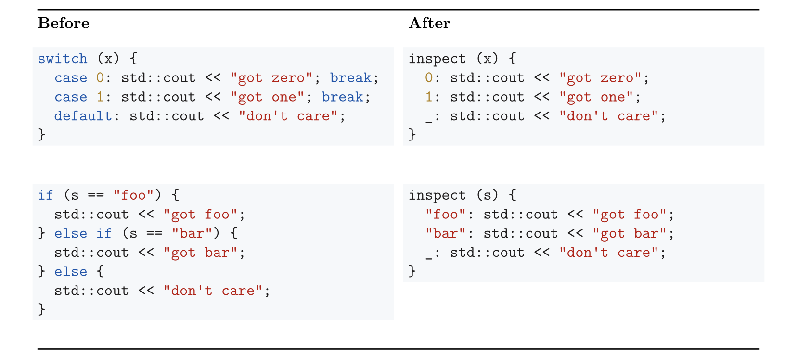

The last block quote `> caption` (if any) is used as the caption.

``````md
::: cmptable

> Put your caption here

### Before
```cpp
switch (x) {
  case 0: std::cout << "got zero"; break;
  case 1: std::cout << "got one"; break;
  default: std::cout << "don't care";
}
```

### After
```cpp
inspect (x) {
  0: std::cout << "got zero";
  1: std::cout << "got one";
  _: std::cout << "don't care";
}
```

:::
``````


### Proposed Wording

#### Paragraph Numbers

Paragraph numbers are [bracketed `Span` elements][divspan] that look
like: `[2]{.pnum}` and `[2.1]{.pnum}`.

```markdown
[2]{.pnum} An expression is _potentially evaluated_ unless it is an unevaluated
operand (7.2) or a subexpression thereof. The set of _potential results_ of
an expression `e` is defined as follows:

- [2.1]{.pnum} If `e` is an _id-expression_ (7.5.4), the set contains only `e`.
- [2.2]{.pnum} If `e` is a subscripting operation (7.6.1.1) with an array operand,
the set contains the potential results of that operand.
```


#### Code Changes

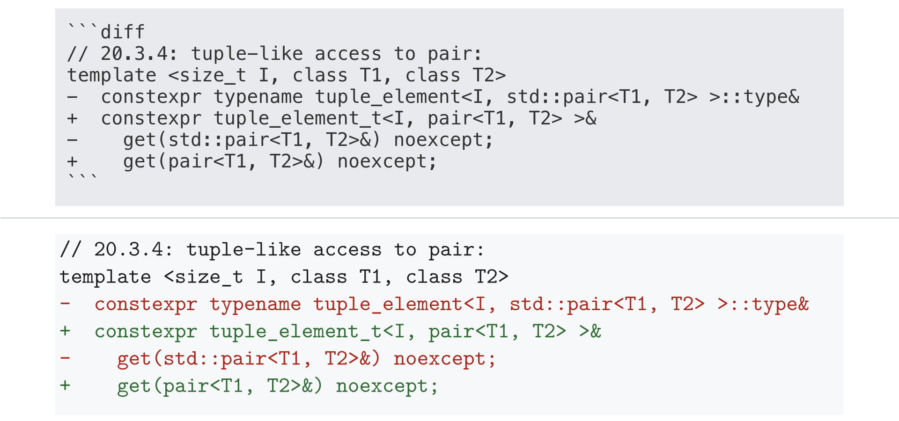

#### Wording Changes

Large changes are [fenced `Div` blocks][divspan] with `::: add` for additions, `::: rm` for removals.

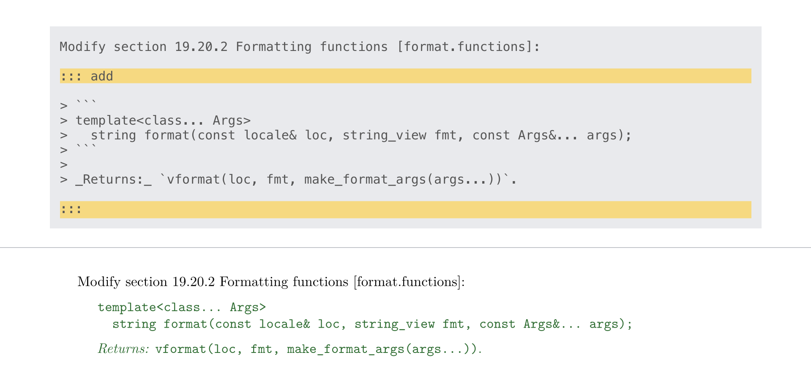

Small, inline changes are [bracketed `Span` elements][divspan] that looks like
`[new text]{.add}` or `[old text]{.rm}`.

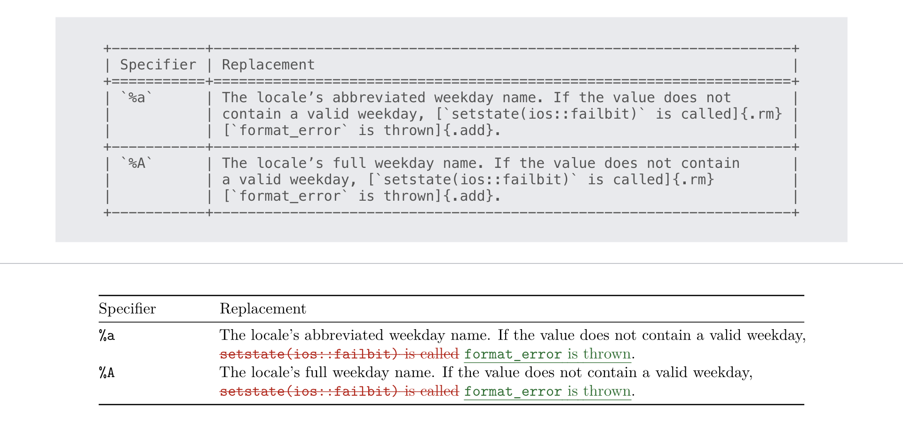

#### Grammar Changes

Use [line blocks][lineblock] (`|`) in order to preserve the leading spaces.

[lineblock]: https://pandoc.org/MANUAL.html#line-blocks

```markdown
> | _selection-statement:_
> |     `if constexpr`_~opt~_ `(` _init-statement~opt~_ _condition_ `)` _statement_
> |     `if constexpr`_~opt~_ `(` _init-statement~opt~_ _condition_ `)` _statement_ `else` _statement_
> |     `switch (` _init-statement~opt~_ _condition_ `)` _statement_
> |     [`inspect` `constexpr`~_opt_~ `(` _init-statement~opt~_ _condition_ `)` `{`
>            _inspect-case-seq_
>        `}`]{.add}
>
> ::: add
> | _inspect-case-seq:_
> |     _inspect-case_
> |     _inspect-case-seq_ _inspect-case_
>
> | _inspect-case:_
> |     _attribute-specifier-seq~opt~_ _inspect-pattern_ _inspect-guard~opt~_ `:` _statement_
>
> | _inspect-pattern:_
> |     _wildcard-pattern_
> |     _identifier-pattern_
> |     _constant-pattern_
> |     _structured-binding-pattern_
> |     _alternative-pattern_
> |     _binding-pattern_
> |     _extractor-pattern_
>
> | _inspect-guard:_
> |     `if (` _expression_ `)`
> :::
```

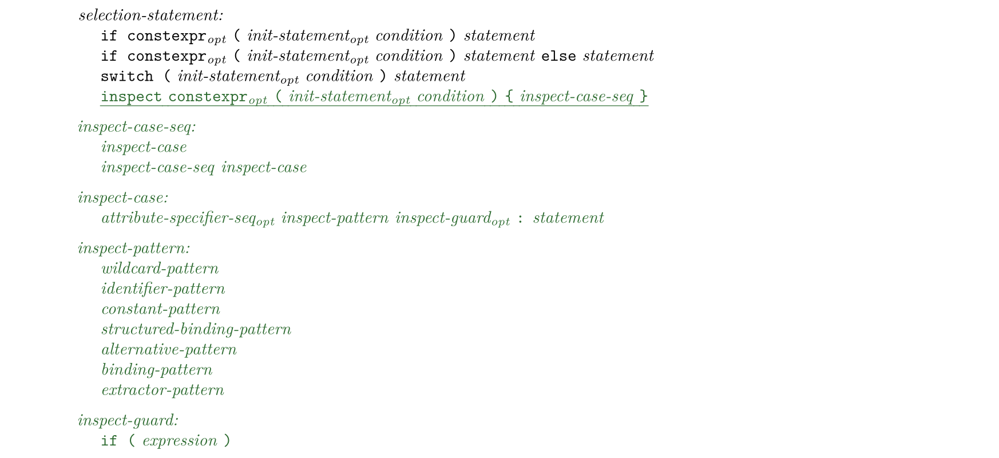

### Stable Names

Stable names are [bracketed `Span` elements][divspan] that look like: `[stable.name]{.sref}`.

```markdown
In [expr.sizeof]{.sref}/5:

The identifier in a `sizeof...` expression shall name a [parameter]{.rm} pack.
The `sizeof...` operator yields the number of [arguments provided for]{.rm}
[elements in]{.add} the [parameter]{.rm} pack [identifier]{.rm} ([temp.variadic]{.sref}).
```


> Run `make update` to update the local cache of `annex-f`.

### Citations

In-text citations look like this: `[@id]`

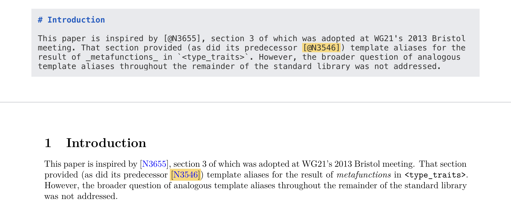

### References

#### Automatic References

The bibliography is automatically generated from <https://wg21.link/index.yaml>
for citations of the following types.

| Type              | Id                                                                            |
| ----------------- | ----------------------------------------------------------------------------- |
| Paper             | __N__*xxxx* / __P__*xxxx*__R__*n*                                             |
| Issue             | __CWG__*xxxx* / __EWG__*xxxx* / __LWG__*xxxx* / __LEWG__*xxxx* / __FS__*xxxx* |
| Editorial         | __EDIT__*xxx*                                                                 |
| Standing Document | __SD__*x*                                                                     |

The `[@N3546]` example from [Citations](#citations) generates:


> Run `make update` to update the local cache of `index.yaml`.

#### Manual References

Manual references are specified in a YAML metadata block similar
to [Title](#title), typically at the bottom of the document.

```yaml
The `id` field is for in-text citations (e.g., [@PAT]),
and `citation-label` is the label for the reference.

Typically `id` and `citation-label` are kept the same.

---
references:
  - id: PAT
    citation-label: Patterns
    title: "Pattern Matching in C++"
    author:
      - family: Park
        given: Michael
    URL: https://github.com/mpark/patterns
---
```


### Unicode Considerations

If you build for LaTeX output and you have Unicode characters in any of
your paper's source code, you may have problems. First, the default PDF engine
simply does not support Unicode characters. You can add `--pdf-engine=xelatex`
to the call to `pandoc` in the `Makefile` to use `xelatex` instead.
That gives you access to some font selections for different parts of your paper
(see the [Fonts] section of the Pandoc manual). The option that controls your
source code fonts is `monofont`. You can add a line with your `monofont` choice
to your YAML metadata block. Here, it's "DejaVu Sans Mono" which provides
glyphs for a large amount of the Unicode characters:

```yaml
---
title: Integration of chrono with text formatting
document: P1361R0
date: 2018-10-16
audience:
  - Library Evolution Working Group
  - Library Working Group
author:
  - name: Victor Zverovich
    email: <victor.zverovich@gmail.com>
  - name: Daniela Engert
    email: <dani@ngrt.de>
  - name: Howard E. Hinnant
    email: <howard.hinnant@gmail.com>
monofont: "DejaVu Sans Mono"
---
```

If you want the list of available fonts on your system, most supported systems will produce a list via the command-line tool `fc-list`.

[Fonts]: https://pandoc.org/MANUAL.html#fonts

## Other Papers

- [P1361]: Integration of chrono with text formatting
- [P1390]: Suggested Reflection TS NB Resolutions

[P1361]: https://wg21.link/p1361
[P1390]: https://wg21.link/p1390

## License

Distributed under the [Boost Software License, Version 1.0](LICENSE.md).

## Resources

  - Blog Post: [How I format my C++ papers](https://mpark.github.io/programming/2018/11/16/how-i-format-my-cpp-papers)
  - Lightning Talk @ C++Now 2019: [WG21 Paper in Markdown](https://www.youtube.com/watch?v=8yReHZOw6QY)
